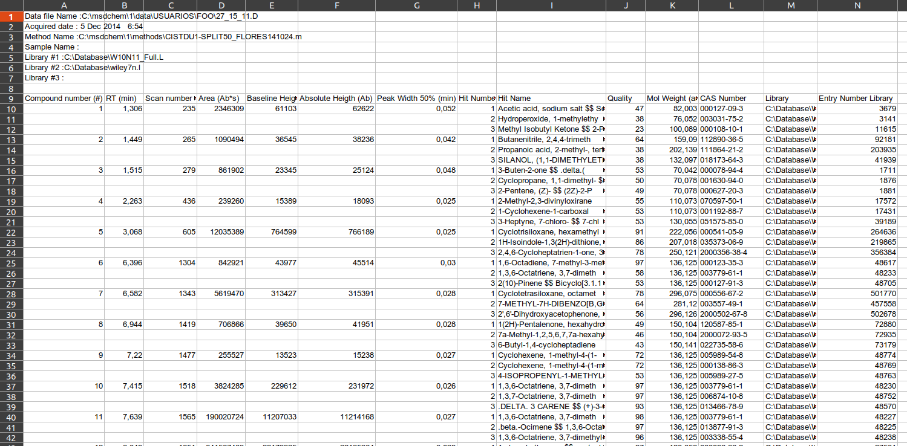
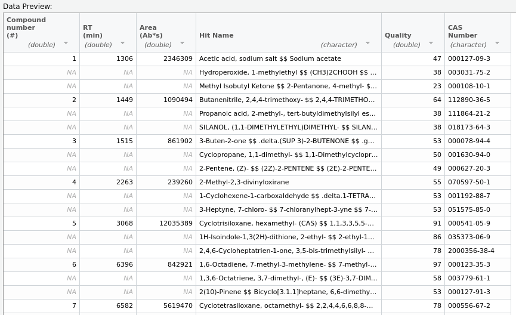
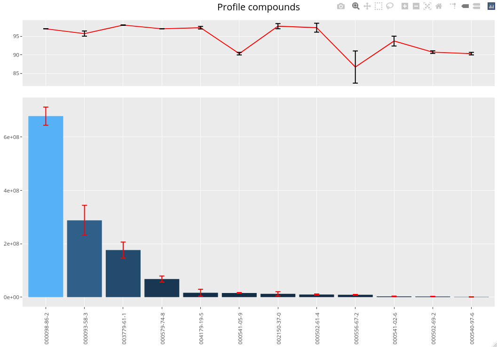

# gcProfileMakeR: an R package for automatic classification of constitutive and non-constitutive metabolites

gcProfileMakeR is an R library used to determine constitutive and non-constitutive metabolites present on a group of samples. It uses as input files in cvs or XLS format produced by Agilent Chemstation GC-MS apparatus.

## Install with devtools from R or RStudio

install.packages(devtools) 

devtools::install_github("fpsanz/gcProfileMakeR")

library(gcProfileMakeR)

## Example of use

### Input file format

In the folder inst/extdata/ there are three files corresponding to three samples used in this tutorial.

These files .xls (Figure 1) are the direct output of por GC-MS Agilent Chemstation Software. please notice that depending on the country, decimal numbers may be separated by coma or point.



The first eight rows of the XLS file should NOT contain compound data. The could be empty or contain metadata. The rest of the rows from position 9 onward, should have the same format as shown in the image. The imported sheet is the one obtaining the name “LibRes”.

The system also admits TSV files separated by tab. In this case, files should have heading and will include only the columns shown in figure 2. Supported extensions (.csv or .tsv)



In both cases, empty cells indicate that the value corresponds to full cells right above.

### Pipeline

The library is developed to execute four functions in sequential steps. 

1. Import file and intrafile normalization (More info in R. ```?NormalizeWithinFiles()``` ).

    ```r
    library( gcProfileMakeR )
    path <- paste(system.file(package = "gcProfileMakeR"), "/extdata", sep="") # or path to your files
    out1 <- NormalizeWithinFiles( path = path,  type = "xls", thr = 2 )
    ```
    
    This step defines the maximal retention time (RT) defined to unify compounds (parameter **thr**). Compounds with low quality can be
    filtered out (parameters **filterLowQual** y **minQuality**). Compounds known as contaminants, or defined by the researcher, can be
    removed from the analysis by ```cas2rm```.
    
2. Group compounds with similar RT values between files. For each group, the most representative CAS number is determined (More info in R. ```?NormalizeBetweenFiles()``` )

    ```r
    out2 <- NormalizeBetweenFiles( data = out1, thr = 2, filterLowQual = 0 )
    ```
    We use as input the object generated in the previous step (```NormalizeWithinFiles```). The parameter **thr** determines the maximum
    RT to group compounds from different files. In this step we can also eliminate low quality compounds. A value of 0 means no filter.

3. Determines constitutive metabolite profiles and non-constitutive profiles (More info in R. ```?getGroups()``` ).

    ```r
    out3 <- getGroups( data = out2, savefiles = FALSE, verbose = TRUE, 
                   qcutoff = c( 85 ), ncFreqCutoff = c( 0.3 ), pFreqCutoff = c( 0.9 ) )
    ```
    
    It takes as input the object previously generated (```NormalizeBetweenFiles```). The most important parameters are:
    
    * ```qcutoff``` a numerical integer value cut-off (mean quality) determining what compounds are considered constitutive by quality and those that are non-constitutive by quality. Default value= 85.
    
    * ```ncFreqCutoff``` a numerical float value between 0-1 indicating a minimal frequency that establishes compounds considered as non-constitutive by frequency. This value should be lower than the value given to ```pFreqCuttoff```. Default value = 0.3.
    
    * ```pFreqCuttoff``` a numerical float value between 0-1 indicating the minimal frequency that establishes compounds considered as constitutive profile. This value should always be higher than ```ncFreqCutoff```. Defalut value = 0.9
    
    Defining *ncFreqCutoff = 0.3*, *pFreqCutoff = 0.9* we obtain that compounds  > 0.9 form the constitutive profile, values 0.3 < frequency <0.9 will be non-constitutive by frequency, and those below < 0.3 are not considered.
    
    ```
    # Output of getGroups

        Profile:
    Compounds with quality > 85 and frequency > 0.9 
    000093-58-3 ; 000098-86-2 ; 000502-61-4 ; 000502-69-2 ; 000540-97-6 ; 000541-02-6 ; 000541-05-9 ; 000556-67-2 ; 
    000579-74-8 ; 002150-37-0 ; 003779-61-1 ; 004179-19-5
    
    Non Constitutive by quality:
    Compounds with quality < 85 and frequency > 0.3 
    000000-00-0 ; 000067-64-1 ; 000077-81-6 ; 000078-94-4 ; 000084-69-5 ; 000084-74-2 ; 000093-89-0 ; 000108-10-1 ; 
    000112-31-2 ; 000112-95-8 ; 000116-09-6 ; 000119-36-8 ; 000124-19-6 ; 000127-09-3 ; 000138-86-3 ; 000141-63-9 ; 
    000142-62-1 ; 000198-96-9 ; 000254-04-6 ; 000471-84-1 ; 000593-45-3 ; 000629-94-7 ; 000629-97-0 ; 000822-06-0 ; 
    001066-42-8 ; 002051-30-1 ; 002439-79-4 ; 003796-70-1 ; 005308-54-3 ; 005340-64-7 ; 005524-05-0 ; 006846-50-0 ; 
    006909-25-7 ; 013450-70-9 ; 013741-21-4 ; 016491-36-4 ; 026431-13-0 ; 031681-28-4 ; 031983-22-9 ; 033156-92-2 ; 
    033567-59-8 ; 040467-04-7 ; 041702-60-7 ; 056438-07-4 ; 061886-66-6 ; 062183-79-3 ; 068177-01-5 ; 070597-50-1 ; 
    074381-40-1 ; 078632-08-3 ; 112890-36-5 ; 120587-85-1 ; 161944-90-7 ; 2000047-69-5 ; 2000071-36-9 ; 2000072-93-5 ; 
    2000073-01-9 ; 2000073-80-5 ; 2000100-43-6 ; 2000137-89-4 ; 2000224-76-5 ; 2000225-57-3 ; 2000344-74-8 ; 2000631-08-8 ; 
    2000741-08-4 ; 2000764-15-0
    
    Non Constitutive by frequency:
    Compounds with quality > 85 and frequency < 0.9 
    000067-66-3 ; 000078-70-6 ; 000087-44-5 ; 000099-93-4 ; 000103-26-4 ; 000104-54-1 ; 000110-54-3 ; 000112-18-5 ; 
    000112-53-8 ; 000118-93-4 ; 000120-51-4 ; 000123-35-3 ; 000294-62-2 ; 000475-20-7 ; 000489-39-4 ; 000621-23-8 ; 
    001467-36-3 ; 001667-01-2 ; 003387-41-5 ; 005989-27-5 ; 010219-75-7 ; 018172-67-3 ; 019713-73-6 ; 2000072-44-7
    ```

4. Plot results (More info in R. ```?plotGroup()``` )
        
    ```r
    ( p <- plotGroup(data = out3, compoundType = "p") )
    ( ncf <- plotGroup(data = out3, compoundType = "ncf") )
    ( ncq <- plotGroup(data = out3, compoundType = "ncq") ) 
    ```
    
    Generate a compound graph. The upper part shows a line of average and standard deviation of compound quality, for each compound. The lower graph shows by bars the average peak area with standard deviation for each compound.
    

    
## Session info

```
R version 4.0.4 (2021-02-15)
Platform: x86_64-pc-linux-gnu (64-bit)
Running under: Ubuntu 20.04.2 LTS

Matrix products: default
BLAS:   /usr/lib/x86_64-linux-gnu/blas/libblas.so.3.9.0
LAPACK: /usr/lib/x86_64-linux-gnu/lapack/liblapack.so.3.9.0

locale:
 [1] LC_CTYPE=es_ES.UTF-8       LC_NUMERIC=C               LC_TIME=es_ES.UTF-8        LC_COLLATE=es_ES.UTF-8    
 [5] LC_MONETARY=es_ES.UTF-8    LC_MESSAGES=es_ES.UTF-8    LC_PAPER=es_ES.UTF-8       LC_NAME=C                 
 [9] LC_ADDRESS=C               LC_TELEPHONE=C             LC_MEASUREMENT=es_ES.UTF-8 LC_IDENTIFICATION=C       

attached base packages:
[1] stats     graphics  grDevices utils     datasets  methods   base     

other attached packages:
 [1] plotly_4.9.3         forcats_0.5.1        stringr_1.4.0        dplyr_1.0.5          purrr_0.3.4         
 [6] readr_1.4.0          tidyr_1.1.3          tibble_3.1.0         tidyverse_1.3.0      egg_0.4.5           
[11] gridExtra_2.3        ggplot2_3.3.3        gcProfileMakeR_1.0.0 devtools_2.3.2       usethis_2.0.1       

loaded via a namespace (and not attached):
 [1] httr_1.4.2        pkgload_1.2.0     viridisLite_0.3.0 jsonlite_1.7.2    modelr_0.1.8      assertthat_0.2.1 
 [7] cellranger_1.1.0  yaml_2.2.1        remotes_2.2.0     sessioninfo_1.1.1 pillar_1.5.1      backports_1.2.1  
[13] glue_1.4.2        digest_0.6.27     rvest_1.0.0       colorspace_2.0-0  htmltools_0.5.1.1 plyr_1.8.6       
[19] pkgconfig_2.0.3   broom_0.7.5       haven_2.3.1       scales_1.1.1      processx_3.4.5    farver_2.1.0     
[25] generics_0.1.0    ellipsis_0.3.1    cachem_1.0.4      withr_2.4.1       lazyeval_0.2.2    cli_2.3.1        
[31] magrittr_2.0.1    crayon_1.4.1      readxl_1.3.1      memoise_2.0.0     evaluate_0.14     ps_1.6.0         
[37] fs_1.5.0          fansi_0.4.2       xml2_1.3.2        pkgbuild_1.2.0    tools_4.0.4       data.table_1.14.0
[43] prettyunits_1.1.1 hms_1.0.0         lifecycle_1.0.0   munsell_0.5.0     reprex_1.0.0      callr_3.5.1      
[49] compiler_4.0.4    rlang_0.4.10      grid_4.0.4        rstudioapi_0.13   htmlwidgets_1.5.3 crosstalk_1.1.1  
[55] labeling_0.4.2    rmarkdown_2.7     testthat_3.0.2    gtable_0.3.0      DBI_1.1.1         curl_4.3         
[61] R6_2.5.0          lubridate_1.7.10  knitr_1.31        fastmap_1.1.0     utf8_1.2.1        rprojroot_2.0.2  
[67] desc_1.2.0        stringi_1.5.3     Rcpp_1.0.6        vctrs_0.3.6       dbplyr_2.1.0      tidyselect_1.1.0 
[73] xfun_0.22  
```
